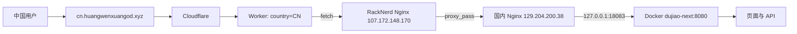
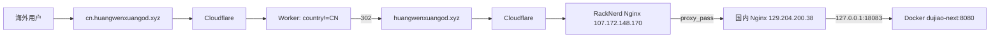
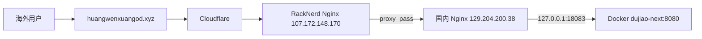

# 五条悟 AI 源头站流量架构

本文记录当前已经部署并验证的访问链路。应用只运行在国内服务器，海外服务器只承担入口转发，不运行商城 Docker 容器。

## 1. 服务器角色

| 角色 | 地址 | 作用 |
| --- | --- | --- |
| Cloudflare | DNS 与 Worker 边缘节点 | HTTPS 接入、代理、按国家判断访问者 |
| 海外入口 | `107.172.148.170`（RackNerd） | Nginx 反向代理 |
| 国内源站 | `129.204.200.38` | Nginx 接收转发并代理到 Docker |
| 应用容器 | 国内源站 `127.0.0.1:18083` | `dujiao-next`，容器内监听 `8080` |

国内源站的 Docker 端口只绑定本机回环地址，应用不直接暴露公网。

## 2. 域名与 Worker

```text
cn.huangwenxuangod.xyz  A -> 107.172.148.170（Cloudflare 橙色代理）
huangwenxuangod.xyz     A -> 107.172.148.170（Cloudflare 橙色代理）
```

Worker 路由绑定：`cn.huangwenxuangod.xyz/*`。

```text
country == CN       保留 cn 域名，继续请求源站
country != CN       302 跳转到 https://huangwenxuangod.xyz/
```

## 3. 国内用户访问 cn



地址栏保持 `https://cn.huangwenxuangod.xyz`。

## 4. 海外用户访问 cn



海外用户最终看到 `https://huangwenxuangod.xyz`。

## 5. 海外用户直接访问主域名



## 6. Nginx 转发关系

RackNerd Nginx 将请求代理到国内源站，并保留域名与客户端信息：

```nginx
proxy_pass http://129.204.200.38;
proxy_set_header Host $host;
proxy_set_header X-Real-IP $remote_addr;
proxy_set_header X-Forwarded-For $proxy_add_x_forwarded_for;
proxy_set_header X-Forwarded-Proto $scheme;
```

## 7. 已验证证据

RackNerd 执行 `curl -4 -I http://129.204.200.38` 返回 `HTTP/1.1 200 OK`，证明海外入口能访问国内源站。

RackNerd 执行 `curl -4 -i -H 'Host: cn.huangwenxuangod.xyz' http://127.0.0.1` 返回 `HTTP/1.1 200 OK`，证明海外 Nginx 转发正常。

RackNerd 执行 `curl -4 -IL https://cn.huangwenxuangod.xyz` 返回 `HTTP/2 302` 和 `location: https://huangwenxuangod.xyz/`，证明海外访问 `cn` 时 Worker 跳转逻辑生效。

主域名此前返回 `404`，原因是 RackNerd 的旧 `card-bot` Nginx 站点抢占了主域名并代理到 `127.0.0.1:8080`；停用其 `sites-enabled` 链接后，两个域名统一由当前代理接管。

## 8. 更新应用

应用更新只在国内源站执行：

```bash
cd ~/dujiao-next
git pull origin main
./deploy.sh
```

海外 RackNerd 不需要拉取 Git 仓库或运行 Docker，只需保持 Nginx 运行。

## 9. 故障排查

国内源站：`curl http://127.0.0.1:18083/health`、`docker ps`、`docker logs --tail=100 dujiao-next`。

海外入口：`systemctl status nginx`、`nginx -t`、`nginx -T`，以及带 Host 头的本机 curl。

Cloudflare 与域名：`dig +short cn.huangwenxuangod.xyz`、`dig +short huangwenxuangod.xyz`、`curl -4 -IL https://cn.huangwenxuangod.xyz`、`curl -4 -I https://huangwenxuangod.xyz`。

## 10. 当前边界

- 分流依据是 Cloudflare 识别到的国家代码；`CN` 保留 `cn`，其他国家跳转主域名。
- 这是域名跳转，不是同一个 URL 下的透明地区分流。
- 两个域名最终都依赖国内应用；海外入口故障会影响海外访问。
- Worker 只绑定 `cn.huangwenxuangod.xyz/*`，主域名不会重复触发该 Worker。
